# Task 3: Data Visualization using amCharts

## Objective
The focus of **Week 3** is on visualizing the data collected and processed in previous weeks. You will utilize **amCharts**, a powerful JavaScript library, to create interactive and visually appealing charts. These visualizations will help uncover patterns and insights in the data more effectively.

## Prerequisites
- **Completion of Week 2**: Ensure that you have a working FastAPI backend to query data from MongoDB.
- **Basic Understanding of HTML and JavaScript**: Familiarity with how to include JavaScript libraries in an HTML page and basic DOM manipulation.

## Tools and Environment Setup
1. **Install and Set Up amCharts**:
   - Include the amCharts library in your project.
   - Set up a basic HTML page to embed your charts.

2. **Prepare Your FastAPI Backend**:
   - Ensure your FastAPI backend is running and ready to serve data to your visualization scripts.

## Dashboard Overview
The visualizations will be combined into an interactive **dashboard** where users can view and explore insights derived from the data.
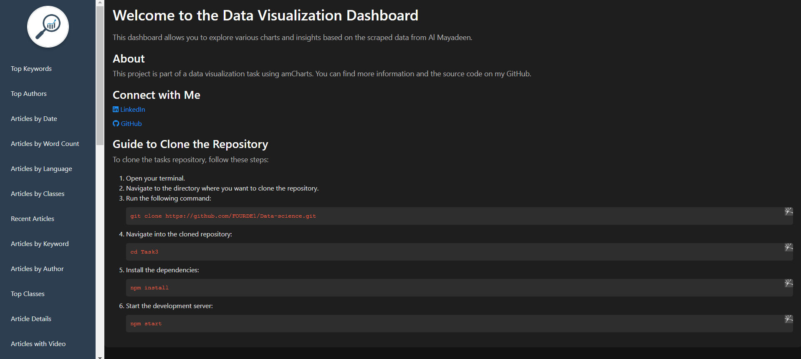

## Visualization Tasks
For each visualization, ensure the corresponding image is stored in the `task_3/images/` folder, with the image named after the task, e.g., `top_keywords.png`.

1. **Top Keywords**
   - **Visualization**: Force-Directed Tree
   - **Explanation**: Displays the relationships between the top keywords across all articles.
   - 

2. **Top Authors**
   - **Visualization**: Bar Chart
   - **Explanation**: Shows which authors have published the most articles.
   - 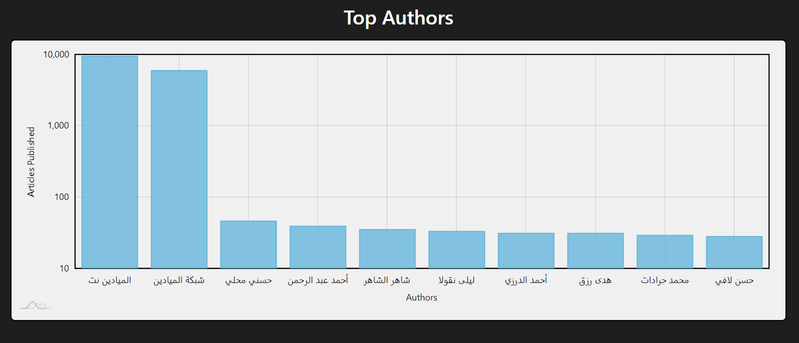

3. **Articles by Date**
   - **Visualization**: Line Chart
   - **Explanation**: Visualizes the number of articles published over time.
   - 

4. **Articles by Word Count**
   - **Visualization**: Histogram
   - **Explanation**: Displays the distribution of articles based on word count.
   - 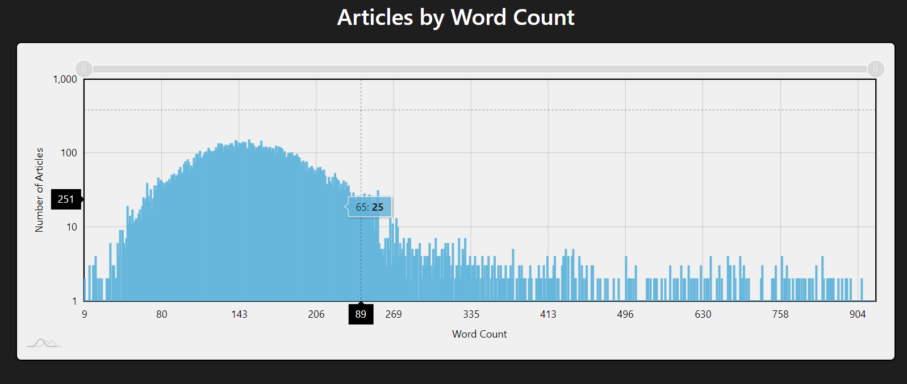

5. **Articles by Language**
   - **Visualization**: Pie Chart
   - **Explanation**: Shows the proportion of articles in each language.
   - 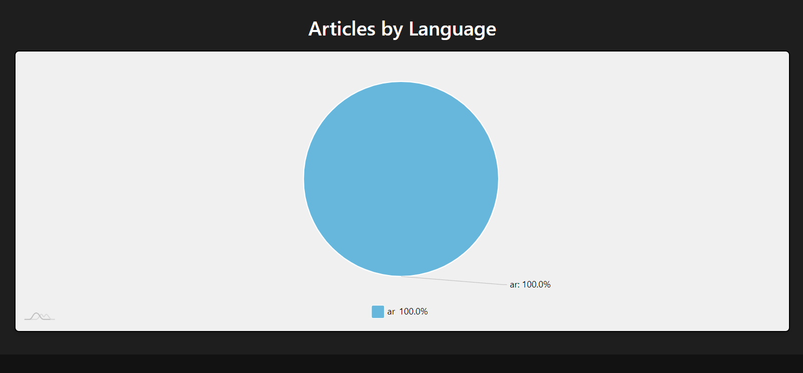

6. **Articles by Category**
   - **Visualization**: Stacked Bar Chart
   - **Explanation**: Displays the distribution of articles across different categories.
   - 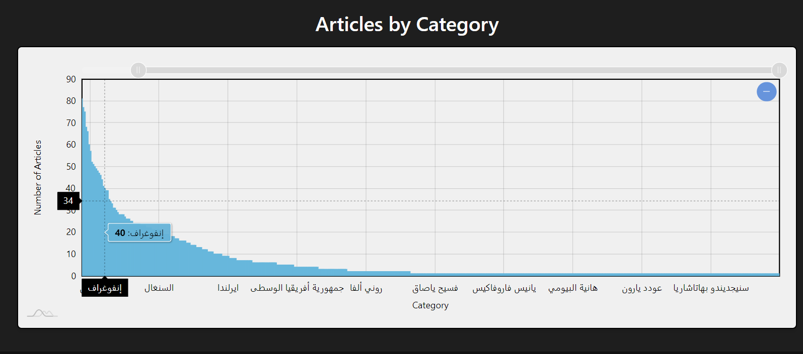

7. **Recent Articles**
   - **Visualization**: Table
   - **Explanation**: Displays titles, dates, and other details of recent articles.
   - 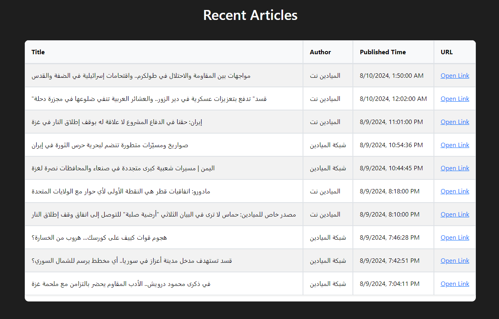

8. **Articles by Keyword**
   - **Visualization**: Bubble Chart
   - 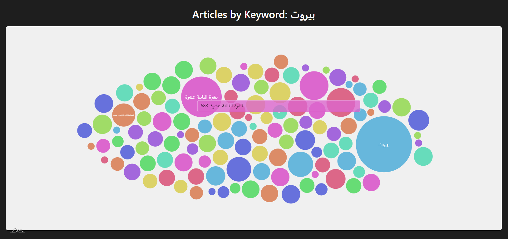

9. **Articles by Author**
   - **Visualization**: Bar Chart
   - **Explanation**: Shows the distribution of articles by a specific author.
   - 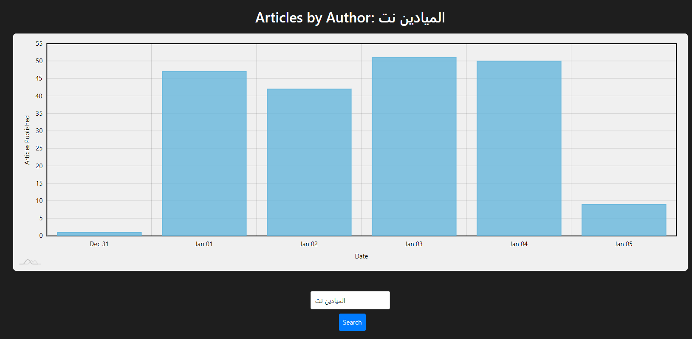

10. **Top Categories**
    - **Visualization**: Force-Directed Tree
    - **Explanation**: Displays the relationships and distribution of articles across top categories.
    - 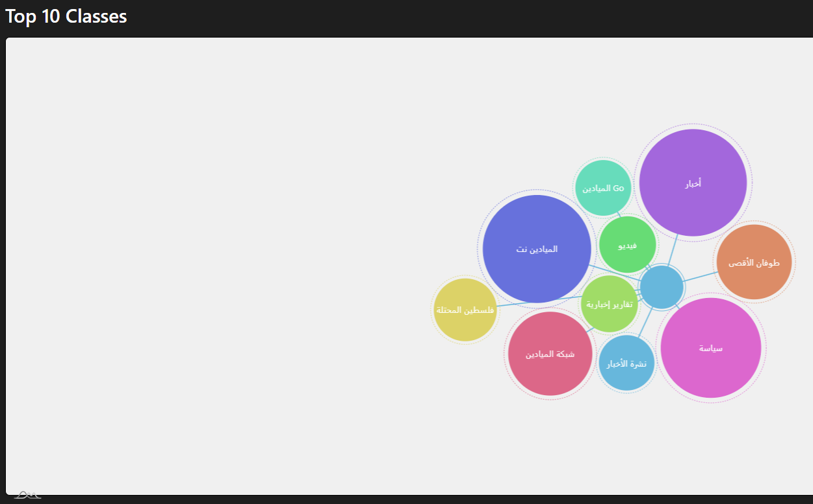

11. **Article Details**
    - **Visualization**: Table
    - **Explanation**: Displays detailed information about specific articles, including title, keywords, and publication date.
    - 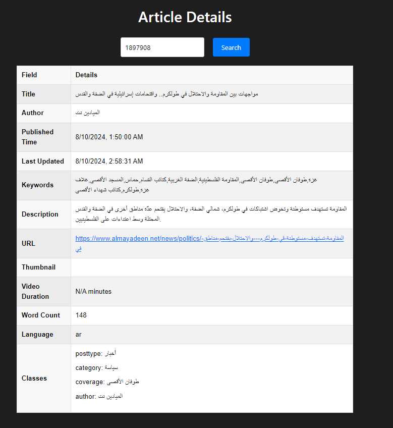

12. **Articles Containing Video**
    - **Visualization**: Bar Chart
    - **Explanation**: Shows the number of articles containing videos.
    - 

13. **Articles by Publication Year**
    - **Visualization**: Bar Chart
    - **Explanation**: Displays the number of articles published each year.
    - 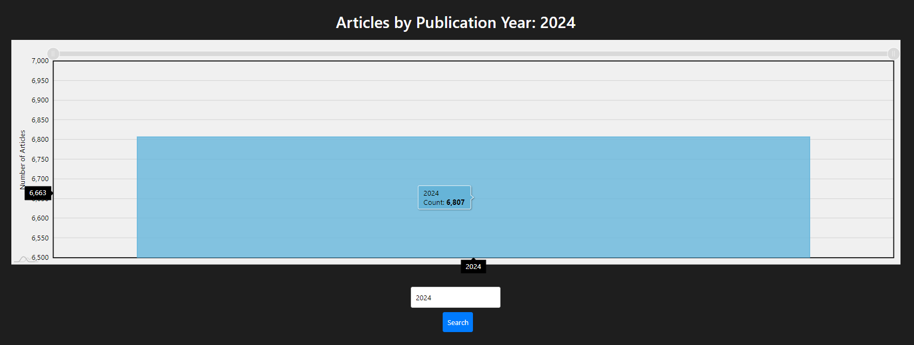

14. **Longest Articles**
    - **Visualization**: Bar Chart
    - **Explanation**: Displays the top 10 longest articles by word count.
    - 

## Technology Stack
- **Frontend**: React
- **Backend**: FastAPI
- **Database**: MongoDB
- **Visualization Library**: amCharts

## Installation and Setup

1. **Clone the Repository**:
   git clone https://github.com/FOURDE1/Data-science.git
   cd Data-science

## Navigate to Task 3:
   cd Task3

## Install Dependencies:
   Ensure you have Node.js installed. Then, install the necessary packages:
   npm install

## Run the React Application:
   To start the development server, use the following command:
   npm start

   The application will be available at http://localhost:3000.

## Configure the Backend:
   Ensure your FastAPI backend is running. The backend should expose the necessary endpoints for the visualizations.
   Refer to the task_2/ folder for backend setup instructions.
